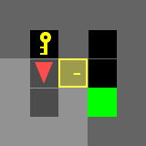
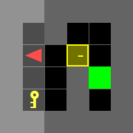
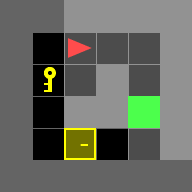
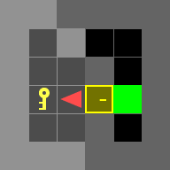
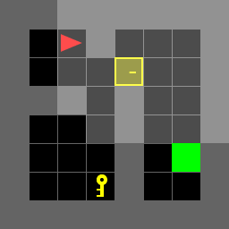
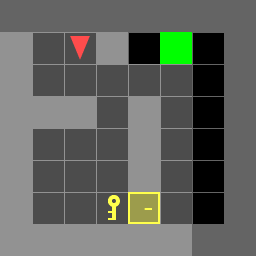
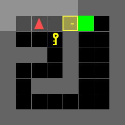

# ECE276B SP24 Project 1

## Overview
In this assignment, you are required to implement dynammic programming for the Door-Key problems.
<p align="center">
</br>
</p>

There are 7 test scenes you have to test and include in the report.

|           doorkey-5x5-normal            |
| :-------------------------------------: |
|  |

|           doorkey-6x6-normal            |            doorkey-6x6-direct            |            doorkey-6x6-shortcut            |
| :-------------------------------------: | :--------------------------------------: | :----------------------------------------: |
|  |  |  |

|           doorkey-8x8-normal            |            doorkey-8x8-direct            |            doorkey-8x8-shortcut            |
| :-------------------------------------: | :--------------------------------------: | :----------------------------------------: |
|  |  |  |

## Run Part A
```
python doorkey_parta.py
```

## Run Part B
```
python doorkey_partb.py
```


